As renewable energy sources such as wind and solar become more prevalent, the energy market faces new challenges—particularly in managing the unpredictability of power supply and the resulting fluctuations in electricity prices. These fluctuations make it difficult for systems like Power-to-X-to-Power (P2X2P) to operate efficiently and profitably. However, by developing a robust spot price prediction model, P2X2P systems can better navigate these fluctuations, storing energy when prices are low and selling it back when prices are high.

This blog post explores the components of a linear regression model designed to predict spot prices, ensuring that P2X2P systems can optimize their operations and maximize profitability. The aim here is to get a reliable baseline model. The code can be found in this [GitHub repository](https://github.com/NoviaIntSysGroup/spot-price-forecast/).

## **The Need for Accurate Spot Price Predictions**

With the increasing integration of intermittent renewable energy sources, the power grid is subject to significant fluctuations in electricity prices. These price swings are primarily driven by the varying availability of renewable energy, such as solar and wind, which are dependent on environmental conditions. For P2X2P systems, which have the capability to store energy when it is cheap and convert it back when prices rise, accurately predicting future spot prices is crucial for determining the best times to store and release energy.

The primary challenge is to create a prediction model that can take into account the complex and dynamic factors influencing spot prices, providing system operators with reliable forecasts that inform their energy management strategies.

## **Building the Model: Key Components**

To tackle the challenge of predicting spot prices, we propose a linear regression model that incorporates three main components: time, external factors, and lagged window averages. Each of these components plays a critical role in capturing the nuances of electricity price fluctuations.

## **1\. Time Component: Capturing Seasonality**

Electricity spot prices exhibit distinct patterns depending on the time of day and the day of the week. For example, prices may be higher during peak hours on weekdays due to increased demand, while weekends might show a different pattern altogether.

- **Seasonality**: The time component captures these seasonal patterns by including 48 dummy variables representing the hours of the day across weekdays and weekends.

- **Granular Insights**: By breaking down the data into specific time intervals, this component helps the model understand how prices typically behave at different times, enabling it to account for these variations in its predictions.

This component is crucial for capturing the predictable aspects of price fluctuations, which are driven by regular, cyclical demand patterns. The following charts for the **Time Component coefficients** illustrate how the linear regression model uses hourly coefficients to capture electricity price patterns for both weekdays and weekends. Each line represents a year from 2016 to 2023, showing how the significance of each hour changes over time.

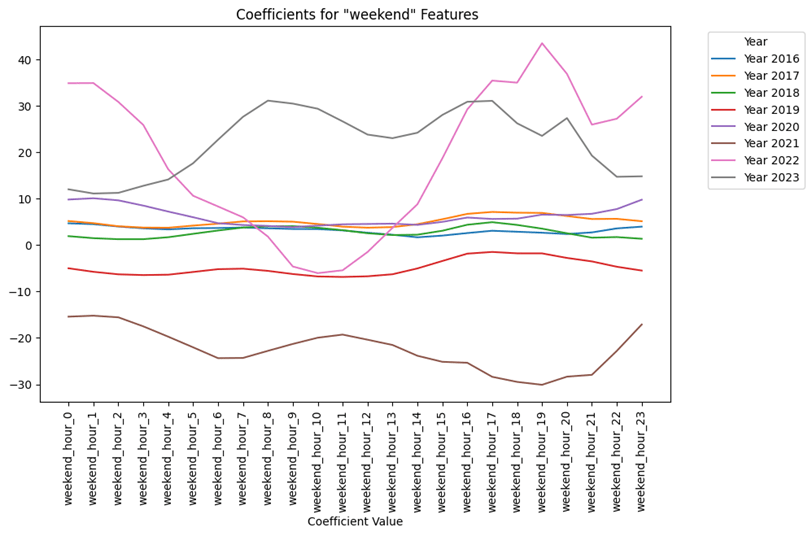

For **weekend hours**, the coefficients show notable variation between years, especially for 2021 and 2023, where there are sharp peaks and troughs. These peaks typically occur in the early morning and mid-evening hours, while the dips are more evident in the afternoon. This suggests that electricity prices on weekends are more volatile, with significant fluctuations in demand at different times of the day, particularly in these years.

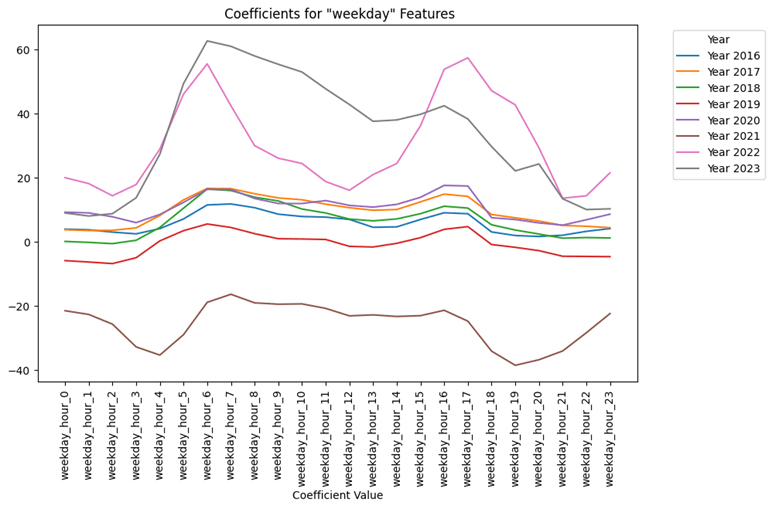

The **weekday hours** coefficients display a more structured pattern, with clear peaks during late morning to early afternoon and dips in the early morning and late evening. Most years show a consistent trend, but 2021 and 2023 stand out with sharper variations, indicating higher price sensitivity during these periods. The 2022 data shows a more stable, less pronounced pattern, which could suggest a period of more predictable demand and supply dynamics during that year.

Overall, the time component captures the cyclical nature of electricity prices by identifying key hours where price fluctuations are most significant. This helps the model to understand daily demand patterns, which is crucial for accurate price predictions.

## **2\. External Component: Accounting for Influential Variables**

Beyond the time of day and week, several external factors significantly influence electricity prices. These factors include:

- **Electricity Production and Demand Forecasts**: These variables reflect the anticipated supply and demand in the energy market, which impact the prices.

- **Renewable Energy Production Forecasts**: Solar and wind power generation forecasts are particularly important, as these sources can cause sharp price changes.

The external component of the model incorporates these variables, allowing it to adjust its predictions based on anticipated changes in supply and demand. By including these external factors, the model can more accurately predict price shifts caused by variations in renewable energy production or unexpected changes in electricity demand.

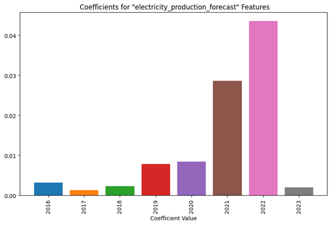

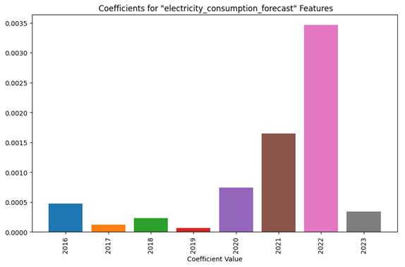

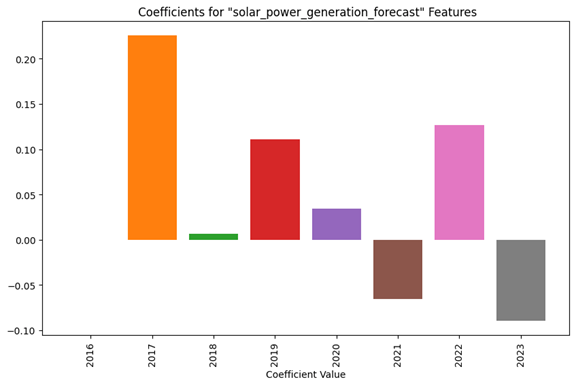

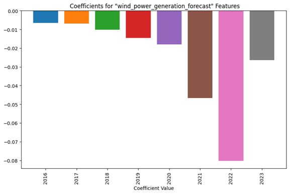

The charts show key trends in how external factors influence electricity prices. For electricity production and consumption forecasts, the coefficients show a clear upward trend, peaking in 2022, suggesting that prices have become more sensitive to production and demand changes over time. This indicates a growing impact of supply-demand dynamics on price predictions.

The solar power generation forecast chart shows fluctuating trends, with significant positive impacts in 2017, minimal impact in 2018, and rising again in 2022, highlighting the varying influence of solar energy depending on the year. Meanwhile, the wind power generation forecast consistently shows negative coefficients, particularly in 2022, suggesting that increased wind forecasts generally lead to lower prices due to greater supply.

## **3\. Lagged Window Average Component: Leveraging Historical Data**

Historical spot prices and external variable values provide a wealth of information that can be used to predict future prices. The lagged window average component serves two primary functions:

- **Baseline Price Calculation**: By considering the average spot price over a specified historical window, this component gives the model a baseline from which to predict future deviations.

- **Trend Analysis**: It also allows the model to detect trends and patterns in how prices evolve over time, providing context for interpreting current data.

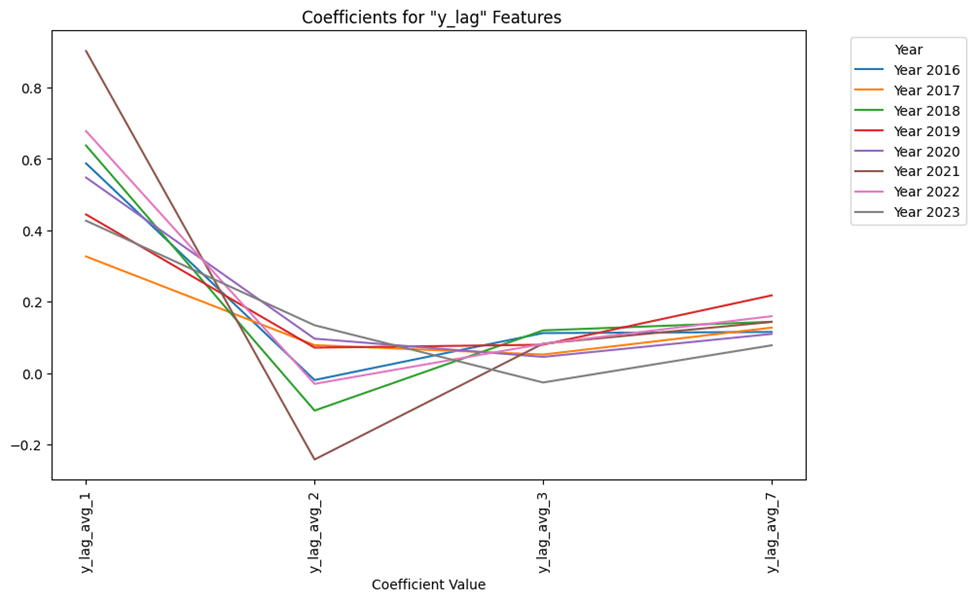

In the chart, **y\_lag\_avg** represents the average electricity spot price over a window of 24 hours at different lag periods. For example, **y\_lag\_avg\_1** refers to the average price of the previous 24 hours (1-day lag), giving the model insight into the most recent market conditions. As the lag increases, **y\_lag\_avg\_2** represents the average price of the 24 hours that occurred two days ago, and so on. Each lag provides the model with a different historical perspective.

The coefficients for these lagged averages indicate how much weight the model places on past prices for predicting future prices. Early lags like y\_lag\_avg\_1 have higher coefficients, showing a strong influence of recent prices. However, the influence drops sharply by y\_lag\_avg\_2, demonstrating an exponential decay effect where recent data is more impactful, but this impact decreases rapidly. Beyond this, the coefficients gradually rise again by y\_lag\_avg\_7, likely because this lag aligns with the average price from the same day a week before, capturing recurring weekly patterns that are important for accurate predictions.

Incorporating historical data helps the model understand how current conditions compare to past trends, enhancing its ability to predict future prices with greater accuracy.

## **Model Equation: Bringing It All Together**

The linear regression model equation combines the contributions of the time component, external factors, and lagged window averages to predict the spot price. The equation is structured as follows:

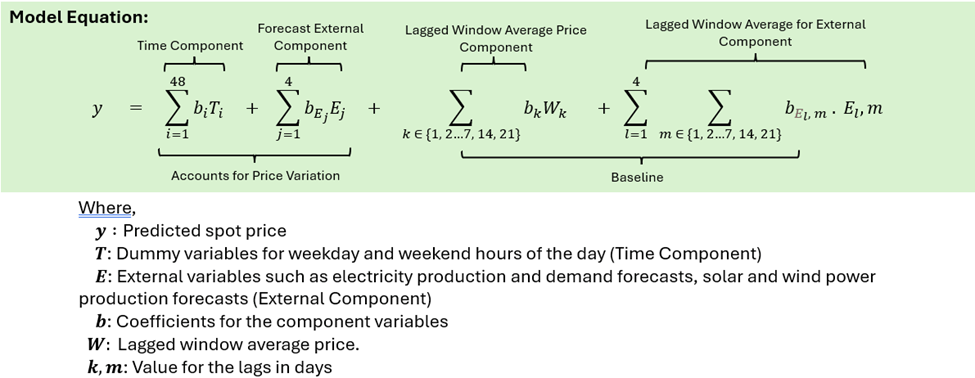

This equation integrates all relevant factors to produce a comprehensive prediction of future spot prices. By considering the time, external influences, and historical data, the model can provide valuable insights into how prices will likely behave, helping P2X2P systems optimize their operations.

> **Avoiding the Dummy Variable Trap**: To accurately capture the influence of time without introducing multicollinearity, the model does not include an intercept. This ensures that all the dummy variables can be included without falling into the “dummy variable trap,” where the sum of the dummy variables could equal the intercept, leading to incorrect estimates.

## **Model Performance: Constructing a Reliable Metric**

In a Power-to-X-to-Power (P2X2P) system, the goal is not just to minimize prediction errors but to strategically identify the hours when electricity prices are at their highest or lowest. This is crucial because these systems have limited operating hours—such as running for only 3 hours a day—and need to maximize efficiency by choosing the most cost-effective time slots. Traditional metrics like Mean Squared Error (MSE) or Mean Absolute Error (MAE) fall short for this purpose because they focus on overall prediction accuracy rather than pinpointing specific high or low-price hours. This is where a custom metric becomes essential: it evaluates the model’s ability to predict the top-k maximum and minimum price hours, providing actionable insights for P2X2P operations.

The charts below compare the accuracy of various linear regression (LR) models as we gradually add more components such as time features, external market data, historical price lags, and their combinations to improve predictions for peak price hours.

## **Starting with the Time Component**

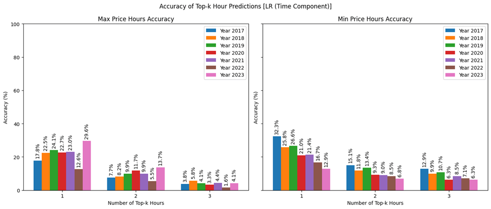

Using only the **Time Component**, the model shows an increasing trend in accuracy for predicting **maximum price hours** from 17.8% in 2017 to 29.6% in 2023, except for 2022. This suggests that time-based patterns can somewhat predict peak prices.

For **minimum price hours**, there is a decreasing trend from 32.3% in 2017 to 12.9% in 2023, indicating that time features alone are less reliable for predicting low-price periods. The mixed results for 2022 suggest that time-based features need additional components to handle irregular patterns effectively.

## **Including Price Lags**

Adding **Price Lags** to the model shows no improvement compared to using just the **Time Component**. This indicates that price lags alone do not provide added value over time-based features for predicting peak or low price periods. However, it is interesting to see that the adding price lags significantly lowers the mean squared error, indicating it is helpful in predicting the spot prices themselves (vs capturing the trend where min and max hours occurs) as seen in figure below:

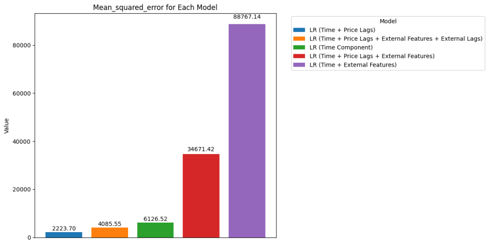

## **Enhancing with External Features**

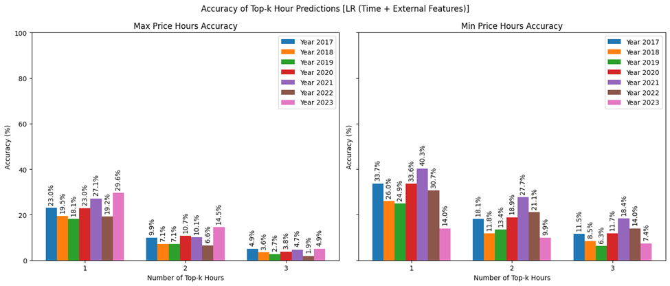

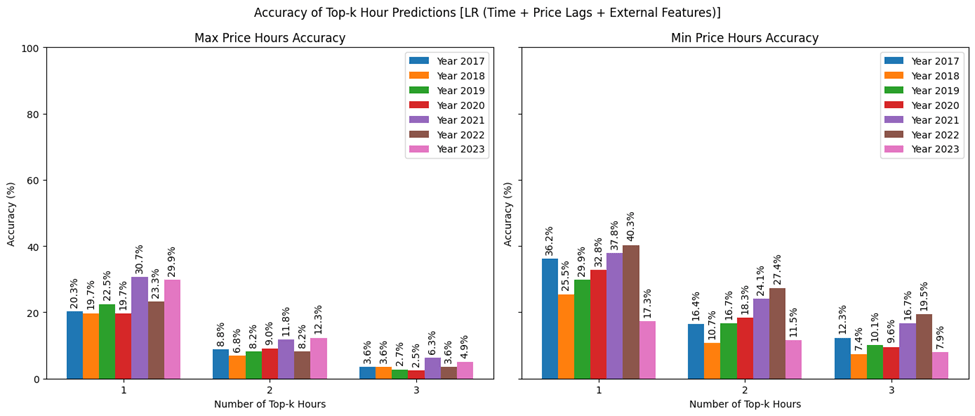

Adding **External Features** like production and demand forecasts slightly improves the model's accuracy for **maximum price hours**, maintaining a similar trend to previous models but with slight gains. For **minimum price hours**, the accuracy sees more significant improvement which suggests external features help better capture low-price periods, though the benefit diminishes for predicting more hours.

## **Including External Lags**

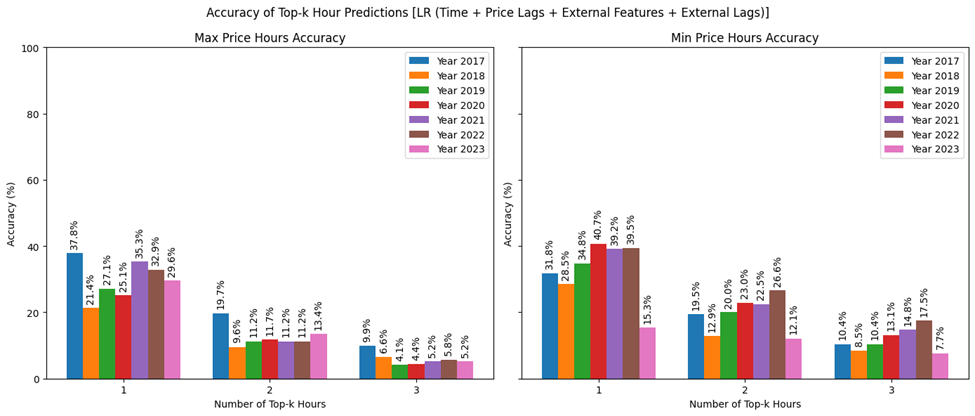

Including **External Lags** generally boosts the model's overall accuracy for predicting both **maximum** and **minimum price hours**, despite occasional drops in specific years. For maximum price hours, the model shows stronger predictive power, indicating that external lagged data enhances the ability to capture peak price trends.

For minimum price hours, while some years show variability in accuracy, the overall trend indicates an improvement. This suggests that, on balance, adding external lags helps the model better identify key price periods, providing more reliable predictions compared to models without these additional historical context features.

## **Comparing the Models**

The summary chart reinforces these findings by showcasing a clear trend: as more components are layered into the model, the accuracy in predicting top-k price hours consistently improves. Notably, adding **External Lags**—which consider past values of external factors—provides a significant lift across all metrics. This approach ensures that the model is not only aware of recent trends but also considers how external influences can shape future price movements.

## **Conclusion: Harnessing Spot Price Forecasting for Profit**

Accurately predicting spot prices is vital for the efficient operation of P2X2P systems in an increasingly renewable-driven energy market. By leveraging a linear regression model that incorporates time-based seasonality, external influencing factors, and historical price data, operators can make informed decisions about when to store and release energy, ultimately maximizing profitability. The combination of these components within the model offers a robust baseline for understanding and predicting the dynamics of electricity prices.

## **Author**
[Ashish Dahal](https://www.linkedin.com/in/adahal/)
