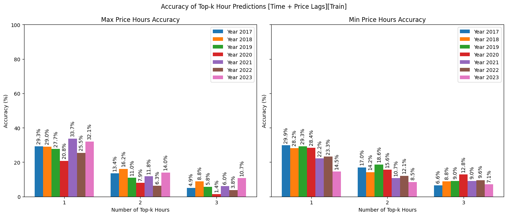

# **Forecasting Day-Ahead Spot Prices for Optimizing Energy Storage Operations**
As renewable energy sources such as wind and solar become more prevalent, the energy market faces new challenges—particularly in managing the unpredictability of power supply and the resulting fluctuations in electricity prices. An energy storage, like a Power-to-X-to-Power (P2X2P) plant, can utilize these fluctuations to make a profit by storing energy when prices are low and selling it back when prices are high. However, the attainable profit is dependent on one's ability to forecast future prices.

This blog post explores the components of a linear regression model designed to predict day-ahead spot prices, ensuring that an energy storage can optimize its operations and maximize profitability. The aim is to get a simple but reliable baseline model against which future enhancements can be compared. The code can be found in the following [GitHub repository](https://github.com/NoviaIntSysGroup/spot-price-forecast/).

## The used linear regression model

Price fluctuations in the spot market are largely driven by variations in supply and demand. Demand tend to vary systematically during the day and between weekdays and weekend, whereas supply is becoming increasingly dependent on the availability of renewable energy, primarily wind in Finland. The linear regression model captures this by predicting systematic and externally driven hourly fluctuations around a baseline computed from lagged averages of previous prices and external variables. The inspiration for the input features has been taken from this [paper](https://www.sciencedirect.com/science/article/pii/S0306261921004529), which discusses the best practices for electricity spot price forecasting. The equation is structured as follows:


> **Avoiding the Dummy Variable Trap**: To accurately capture the influence of time without introducing multicollinearity, the model does not include an intercept. This ensures that all the dummy variables can be included without falling into the “dummy variable trap,” where the sum of the dummy variables could equal the intercept, leading to incorrect estimates.

## **1\. Time Component: Capturing Daily Patterns**

Electricity spot prices exhibit distinct patterns depending on the time of day and the day of the week. For example, prices may be higher during peak hours on weekdays due to increased demand, while weekends might show a different pattern altogether.

- **Daily Pattern**: The time component captures these daily patterns by including 48 dummy variables representing the hours of the day across weekdays and weekends.

It’s essential to represent the time component in a way that the model can understand. One way to do it is using [one-hot encoding](https://www.researchgate.net/profile/Jamell-Samuels/publication/377159812_One-Hot_Encoding_and_Two-Hot_Encoding_An_Introduction/links/6597e5c90bb2c7472b35fbb5/One-Hot-Encoding-and-Two-Hot-Encoding-An-Introduction.pdf). Our model involves creating two sets of 24 features—one for weekdays and one for weekends—where each feature represents an hour of the day. For example, if the time is 10 AM on the weekend, the feature corresponding to the 10th hour in the weekend set is set to 1, while the other 23 features in the weekend set and all 24 features in the weekday set are set to 0. This distinct encoding allows models to differentiate between the same hour occurring on a weekday versus a weekend, capturing temporal patterns more accurately.

This component is crucial for capturing systematic price fluctuations, driven by regular cyclical demand patterns. The graphs below show the time component coefficients found for the year 2023. The daily and hourly patterns highlight that the price of electricity tends to be more expensive during the day, with two price peaks (one in the morning and one in the evening), and that the price tends to be lower during weekends than weekdays.


## **2\. External Component: Accounting for Influential Variables**

Beyond the time of day and week, several external factors can influence electricity prices. The factors include in the model are:

- **Electricity Production and Demand Forecasts**: These variables reflect the anticipated supply and demand in the energy market.

- **Renewable Energy Production Forecasts**: Solar and wind power generation forecasts.

## **3\. Lagged Window Average Component: Leveraging Historical Data**

Historical values for spot prices and external variable values provide information that can be used to predict the baseline around which daily fluctuations occur as well as ongoing trends. This historical information is included in the model through lagged windowed average features. The found coefficients for these indicate which historical information the model considers relevant. For example, the graph below highlights how much weight the model places on past prices for predicting future prices, and it indicates that the average price during the previous day is seen as the most important.


## **Model Performance: Constructing a Reliable Metric**

For an energy storage, the goal is not just to minimize prediction errors but to strategically identify the hours when electricity prices are at their highest or lowest. This is crucial because the system may have limited charging and discharging hours due to the limited storage. Traditional metrics like Mean Squared Error (MSE) or Mean Absolute Error (MAE) fall short for this purpose because they focus on overall prediction accuracy rather than pinpointing specific high or low-price hours. Custom metrics are, therefore, essential, and one possibility is to evaluate the model’s ability to predict the top-k maximum and minimum priced hours.

We thus define model accuracy as the proportion of days where the top-k highest (or lowest) predicted hours match the actual top-k highest (or lowest) hours, formally written as:


The charts below compare the accuracy of various linear regression (LR) models as we gradually add external variables and their lagged averages. All models are trained on data from one year. We show results on both test and training sets, where the test set always consists of data from the subsequent year that was not used for training.

## **Time Component + Price Lags**




## **Enhancing with External Features**


## **Including External Lags**


The first model without external features shows decreasing performance for each passing year in predicting the hours with the lowest prices. This likely reflects the growing impact of wind power on available supply, as the performance increases when external variables are included (hourly wind power production forecasts being one external variable).ss The effect of the lagged external variables is less clear to pinpoint, but including these seems to result in a performance boost for both training and test sets, most clearly seen in the average accuracies over all years below. The benefit of including external variables is also systematically seen in the test sets, indicating that the models learn knowledge that is transferable from one year to the next.

## **Comparing the Models**


## **Conclusion: Harnessing Spot Price Forecasting for Profit**

Accurate spot price forecasts are vital for operating an energy storage optimally, especially today as prices are becoming more volatile due to an increasingly renewable-driven energy market. We developed and evaluated a simple but understandable linear regression model that incorporates time components and external variables to predict hourly fluctuations around a baseline predicted from lagged windowed averages of historical values for price and external variables. The combination of these components resulted in a simple model offering a robust baseline for understanding and predicting the dynamics of day-ahead spot prices.

## Installation

Create a new conda environment with python and install using pip in editable mode.
```bash
$ conda create -n spot-price-forecast python=3.11
$ conda activate spot-price-forecast
$ git clone git@github.com:NoviaIntSysGroup/spot-price-forecast.git
$ cd spot-price-forecast
$ pip install -e .
```

You need to add .env file with you API key for Fingrid's API to download additional day-ahead forecasts for electricity production and consumption in Finland as well as day-ahead forecasts for wind and solar production. The repositorie's data folder includes hourly values from 2016 to 2023.
```bash
$ echo "FINGRID_API_KEY=YOUR_API_KEY" > .env
```

## Usage

* The notebook [fetch_data_from_fingrid](notebooks/fetch_data_from_fingrid.ipynb) shows how to download data from Fingrid's API and save it to the data folder. 

* The notebook [electricity_spot_price_prediction](notebooks/electricity_spot_price_prediction.ipynb) shows how to train the model and save predictions.

* The notebook [visualizations](notebooks/visualizations.ipynb) shows how to visualize the model's coefficients and evaluations.


## Authors

Johan Westö, [Ashish Dahal](https://www.linkedin.com/in/adahal/), 
